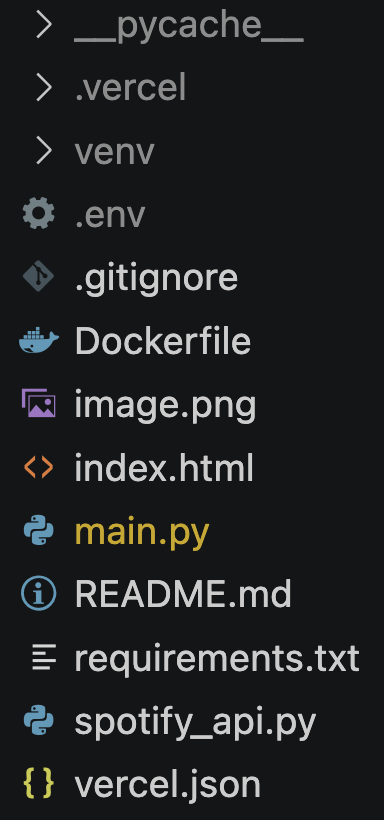

# BEATYAVIBE
BEATYAVIBE(이하 비챠바입)은 Spotify API를 사용하여 아티스트의 곡을 검색하고 추천하는 웹 애플리케이션입니다.  

## 기능
- 아티스트 이름으로 곡 검색
- 검색된 곡 목록 표시
- 곡 링크를 통해 Spotify에서 직접 듣기

## 사용하기
[여기서 바로 사용하실 수 있습니다.](https://port-0-beatyavibe-m4zzgmuf7c4d0496.sel4.cloudtype.app)

### 설치

1. 이 저장소를 클론합니다.

```bash
git clone https://github.com/justn-hyeok/BEATYAVIBE
cd BEATYAVIBE
```

2. 필요한 패키지를 설치합니다.

```bash
pip install -r [requirements.txt](http://_vscodecontentref_/0)
```

3. 환경 변수를 설정합니다. 프로젝트 루트 디렉토리에 `.env` 파일을 생성하고 다음 내용을 추가합니다.

```
CLIENT_ID=your_spotify_client_id
CLIENT_SECRET=your_spotify_cliend_secret
```

### 실행

1. 백엔드 서버를 실행합니다

```
uvicorn backend.main:app --reload
```

2. 웹 브라우저에서 `http://127.0.0.1:8000`에 접속합니다.

### 사용 방법

1. 웹 페이지에서 아티스트 이름을 입력하고 "Search" 버튼을 클릭합니다.
2. 검색된 곡 목록이 표시됩니다.
3. 곡 제목을 클릭하여 Spotify에서 직접 들을 수 있습니다.

## 파일 구조



## 만든 사람
- [HWANG JUN HYEOK](https://www.instagram.com/wnsgurjh_/)